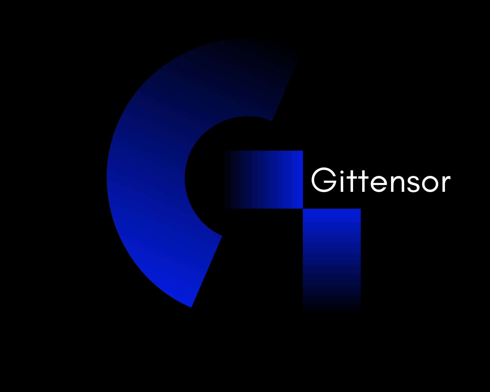

  

# Gittensor

Gittensor aims to accelerate the development of open source software (OSS) and enable OSS developers to be rewarded for meaningful work. We incentivize open source contributions.

## Socials

- **Website:** [gittensor.io](https://gittensor.io)
- **X (Twitter):** [@gittensor_io](https://x.com/gittensor_io)
- **Discord:** [Join our channel, 74, in the Bittensor discord](https://discord.gg/aK2ZNUQfRt)

---

## At a Glance

- **Miners**: Provide a fine-grained Github personal access token (PAT) and create pull requests (PRs) to recognized repositories.
- **Validators**: Utilize miner PATs to authenticate account ownership and search recognized repositories for successfully merged miner PRs

---

## Miners

See full guide **[here](gittensor/miner/README.md)**

## Validators

See full guide **[here](gittensor/validator/README.md)**

## Scoring & Rewards

### Important Structures

- Master Repositories & Weights

A list of repositories pulled from github that have been deemed valid for scoring. They each have an associated weight based on factors like: forks, commits, contributors, stars, etc.

_NOTE: this list will be dynamic. It will see various audits, additions, deletions, weight changes, and shuffles as the subnet matures._

_NOTE: don’t be afraid to provide recommendations for your favorite open source repositories and the team will review it as a possible addition. A repo is more likely to be included if: they provide contributing guidelines, are active/community driven, provide value/have users_

- Programming Language Weights

A list of major file types/extensions, mostly related to programming languages, but also plenty of markdown, documentation, and other common files are included. Each extension has a weight as well for scoring.

_NOTE: this list will also be dynamic. Additions, and weight changes will occur as the subnet matures._

### Scoring

Valid PR filtering
There are multiple checks that a PR must pass to be considered valid for scoring

- PR is in a `Merged` state
- PR is made to a repository in the master repository list
- PR is within the lookback window, `MERGED_PR_LOOKBACK_DAYS`
- PR is NOT merged by the person who created it (self-merged)
- PR is merged to the dafault branch of the repository (depending on specific repository setup this may be a production or dev branch)
- PR is merged to a repository BEFORE it was considered ‘inactive’ in the master repository list

### Calculating Score

A miner's score is the sum of scores across their valid merged pull requests

$$
S_{\text{miner}} = \sum_{p \in \text{PRs}} S_p
$$

where each pull request score $S_p$ is calculated as a sum of file scores:

$$
S_p = w_{\text{repo}} \cdot \beta_{\text{issue}} \cdot \sum_{f \in \text{Files}_p} w_{\text{lang}}(f) \cdot r_f \cdot c_f^{0.75}
$$

where:

- $w_{\text{repo}}$ — Repository weight from master repository list (incentivized repos have higher weights)
- $\beta_{\text{issue}}$ — Issue resolution bonus multiplier (applied if the PR resolves an issue)
- $w_{\text{lang}}(f)$ — Programming language weight for file $f$ based on file type/extension
- $c_f$ — Total changes (additions + deletions) in file $f$
- $r_f$ — Normalized file PR changes
- $c_f^{0.75}$ — Scaling factor to mitigate disproportionate rewards for large changes

And a single file's score can be calculated as:

$$
\text{FileScore}(f) = w_{\text{lang}}(f) \cdot \left(\frac{c_f}{\sum_{f' \in \text{Files}_p} c_{f'}}\right) \cdot c_f^{0.75}
$$

Remarks:

1. **Repository incentivization**: Master repositories with higher weight contribute more to final scores
2. **Language weighting**: More valuable programming languages (e.g., C++, Rust) receive higher weights
3. **Proportional contribution**: Each file's score is normalized by total PR changes
4. **Diminishing returns**: The $0.75$ exponent hinders gaming by inflating line counts but still gives score for bigger PRs
5. **Issue solve boost**: PRs that solve issues receive a boost multiplier, giving them more value/score

Finally, not captured in the equations above, there is also a uniqueness boost multiplier that can further increase score for miners who consistently make PRs across a wider variety of repositories.

For more details read through our various **[scoring](gittensor/validator/evaluation/scoring.py)** and **[rewards](gittensor/validator/evaluation/reward.py)** functions.

### Errors/Penalties

- Github account too young error

We implement a minimum github account age of 180 days to discourage new account spamming/creation. Any PRs submitted from accounts that do not meet minimum age requirements will not be evaluated, and their score will be set to zero. See [here](gittensor/constants.py)for the exact value.

- Duplicate miner penalty

A duplicate miner is defined as a miner who’s github PAT resolves to a github id that another miner is using. Effectively, it is multiple miners using the same account. Upon detection, all duplicated miners receive 0 score.

- Excessive Open PR spam penalty

Miners who open PRs excessively will see their score reduced by a penalty multiplier. This multiplier will decrease linearly for every open PR above a certain threshold. See [here](gittensor/constants.py) for the current penalty constants

### Collaborative emissions scaling

Adopted from bitcast, subnet 93, collaborative emissions scaling has the network ‘unlock’ emissions as more miners join and earn a score. Miners will benefit by experiencing individual and cumulative network growth. Two major values affecting the total emissions unlocked rate are:

- Total lines changed within the last 30 days (`MERGED_PR_LOOKBACK_DAYS`)
- Total unique repositories contributed to within the last 30 days

As total lines changed and total unique repositories increases, the percentage of total available emissions increases. Whatever is not released is recycled.

The rate of emissions unlocked will be monitored and adjusted as the subnet matures to ensure fair distribution of alpha.
