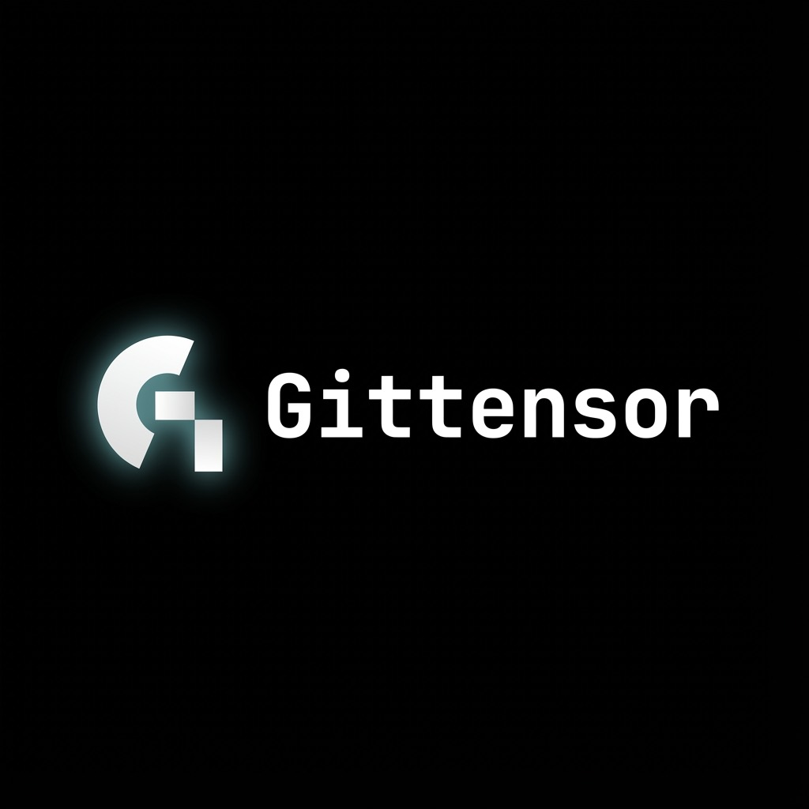

<p align="center">
  <a href="https://gittensor.io/">
    
  </a>
</p>

# Gittensor

Incentivize open source contributions.

[](https://gittensor.io)
[](https://discord.com/invite/bittensor)
[](https://x.com/gittensor_io)

## Introduction

[Gittensor](https://gittensor.io/) is a [Bittensor subnet](https://docs.learnbittensor.org/subnets/understanding-subnets) (SN74) that accelerates open source software development by rewarding meaningful contributions. Miners earn TAO by making real, merged pull requests to recognized open source repositories.

## How it Works

Miners register with a fine-grained [GitHub personal access token](https://docs.github.com/en/authentication/keeping-your-account-and-data-secure/managing-your-personal-access-tokens) (PAT) and contribute to whitelisted open source repositories. When their pull requests get merged, validators authenticate account ownership via the PAT, verify the merged contributions, and score them based on code quality, repository weight, and programming language factors. Rewards are distributed proportionally to contribution scores.

## Why Gittensor

Open source powers the modern world, yet most contributors work for free. Gittensor solves this by creating a decentralized marketplace where:

- **Real work gets rewarded** — Only merged PRs to legitimate repositories earn emissions
- **Quality over quantity** — Semantic code analysis evaluates actual contribution value
- **Sybil-resistant** — GitHub account verification and merge requirements prevent gaming

The result: a sustainable incentive layer that channels resources toward building and maintaining the software we all depend on.

---

## Issue Discovery (Beta)

Gittensor also rewards miners for **discovering issues** that lead to merged PRs. When you find a bug or identify a needed feature in a whitelisted repository and someone else solves it with a merged PR, you earn issue discovery rewards.

### How It Works

1. **Register a GitHub issue** on any whitelisted repository
2. **Someone solves it** with a merged PR
3. **Earn issue discovery score** based on the quality of the solving PR

### Credibility System

Issue discovery uses a separate credibility score from PR contributions:

```
issue_credibility = solved_issues / (solved_issues + closed_issues)
```

- **Solved issue**: Closed via a merged PR — counts toward credibility
- **Closed issue**: Closed without a merged PR — counts against credibility
- **Transferred issue**: Treated as failed — prevents gaming via repo transfers

### Qualification Gates

To be eligible for issue discovery rewards:
- Minimum **7 valid solved issues** (solving PR must have token_score ≥ 5)
- Minimum **80% issue credibility**
- One credibility mulligan (mirrors OSS contribution rules)

### Scoring

- **Base score** = base score of the solving PR
- **Contribution bonus** = passes through from PR quality (threshold: 2000)
- **Review quality multiplier** = applies to both solver and discoverer equally
- **No double dipping** = same account as PR author earns 0 discovery score (but issue still counts for credibility)

### Emission Split

- OSS contributions: 30%
- **Issue discovery: 30%**
- Issue treasury: 15%
- Recycle: 25%

See full specification in [issue_discovery/issue-discovery-rewards.md](issue_discovery/issue-discovery-rewards.md).

---

## Miners

No miner neuron required — just register your GitHub PAT with validators using the CLI.

```bash
# Install
git clone https://github.com/entrius/gittensor.git
cd gittensor
uv sync

# Set your GitHub PAT
export GITTENSOR_MINER_PAT=ghp_your_token_here

# Broadcast PAT to validators
gitt miner post --wallet <name> --hotkey <hotkey>

# Check which validators have your PAT stored
gitt miner check --wallet <name> --hotkey <hotkey>
```

See full guide **[here](https://docs.gittensor.io/miner.html)**

## Validators

**Recommended: Deploy with Docker and Docker Watchtower for automatic updates**

```bash
# Quick start
git clone https://github.com/entrius/gittensor.git
cd gittensor
cp .env.example .env
# Edit .env with proper values
nano .env

docker-compose -f docker-compose.vali.yml up -d
```

See full guide **[here](https://docs.gittensor.io/validator.html)**

## Reward Algorithm

### Important Structures

- Master Repositories & Weights

A list of repositories pulled from GitHub that have been deemed valid for scoring. They each have an associated weight based on factors like: forks, commits, contributors, stars, etc.

_NOTE: this list will be dynamic. It will see various audits, additions, deletions, weight changes, and shuffles as the subnet matures._

_NOTE: don’t be afraid to provide recommendations for your favorite open source repositories and the team will review it as a possible addition. A repo is more likely to be included if: they provide contributing guidelines, are active/community driven, provide value/have users_

- Programming Language Weights

A list of major file types/extensions, mostly related to programming languages, but also plenty of markdown, documentation, and other common files are included. Each extension has a weight for scoring. If the extension has a language full name then code in those languages will be evaluated using token-based scoring.

_NOTE: this list will also be dynamic. Additions, and weight changes will occur as the subnet matures._

- Token Weights

Weights assigned to AST (Abstract Syntax Tree) node types for token-based scoring, including structural elements (functions, classes) and leaf tokens (identifiers, literals), enabling semantic evaluation of code changes.

### Scoring

See full guide **[here](https://docs.gittensor.io/scoring.html)**

## License

MIT - See [LICENSE](LICENSE) for details.
