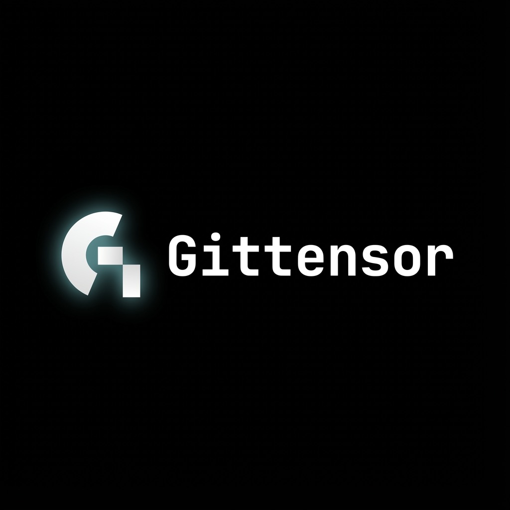

<p align="center">
  <a href="https://gittensor.io/">
    
  </a>
</p>

# Gittensor

Incentivize open source contributions.

[](https://gittensor.io)
[](https://discord.com/invite/bittensor)
[](https://x.com/gittensor_io)

## Introduction

[Gittensor](https://gittensor.io/) is a [Bittensor subnet](https://docs.learnbittensor.org/subnets/understanding-subnets) (SN74) that accelerates open source software development by rewarding meaningful contributions. Miners earn TAO by making real, merged pull requests to recognized open source repositories.

## How it Works

Miners register with a fine-grained [GitHub personal access token](https://docs.github.com/en/authentication/keeping-your-account-and-data-secure/managing-your-personal-access-tokens) (PAT) and contribute to whitelisted open source repositories. When their pull requests get merged, validators authenticate account ownership via the PAT, verify the merged contributions, and score them based on code quality, repository allocation, and programming language factors. Rewards are distributed within each repository's configured emission share.

## Why Gittensor

Open source powers the modern world, yet most contributors work for free. Gittensor solves this by creating a decentralized marketplace where:

- **Real work gets rewarded** — Only merged PRs to legitimate repositories earn emissions
- **Quality over quantity** — Semantic code analysis evaluates actual contribution value
- **Sybil-resistant** — GitHub account verification and merge requirements prevent gaming

The result: a sustainable incentive layer that channels resources toward building and maintaining the software we all depend on.

---

## Miners

No miner neuron required — just register your GitHub PAT with validators using the CLI.

```bash
# Install
git clone https://github.com/entrius/gittensor.git
cd gittensor
uv sync

# Set your GitHub PAT
export GITTENSOR_MINER_PAT=ghp_your_token_here

# Broadcast PAT to validators
gitt miner post --wallet <name> --hotkey <hotkey>

# Check which validators have your PAT stored
gitt miner check --wallet <name> --hotkey <hotkey>
```

See full guide **[here](https://docs.gittensor.io/miner.html)**

### Compute miners (serving)

Gittensor also pays verified GPU time: an RTX 5090 running the blessed inference release earns **$0.70 per
verified GPU-hour** (paid in alpha, inside a 3.5% emission cap). Validators verify the traffic they route to you
against their own reference GPU — there is no separate audit prompt set — so a new miner sits in *probation*
until its rolling window passes, then goes READY. One card = one payout; extra hotkeys on the same card share it.

```bash
# 1. Runtime: the pinned sparkinfer build + SHA-pinned model (see gittensor/validator/weights/serving_loadout.json)
docker run -d --name sparkinfer --gpus all -p 8080:8080 -v sparkmodels:/opt/sparkinfer/models \
  -e MODEL_SHA256=<model_sha256 from the loadout> -e SPARKINFER_DETERMINISTIC=1 entrius/sparkinfer:<runtime_pin>

# 2. Prove it is conformant before you serve
uv run python scripts/check_serving_runtime.py --base-url http://127.0.0.1:8080 --model-id qwen3.6-35b-a3b

# 3. Miner neuron (env from .env.example: NETUID, WALLET_NAME, HOTKEY_NAME, SUBTENSOR_NETWORK, PORT, ...)
docker run -d --env-file .env --network host -v ~/.bittensor/wallets:/root/.bittensor/wallets:ro \
  --entrypoint /app/scripts/serving-miner-entrypoint.sh gittensor-miner
```

Your status (READY / probation / quarantined, window, throughput, estimated payout, last miss reason) is on
[gittensor.io/compute](https://gittensor.io/compute). See full guide **[here](https://docs.gittensor.io/compute-miner.html)**

## Validators

**Recommended: Deploy with Docker and Docker Watchtower for automatic updates**

```bash
# Quick start
git clone https://github.com/entrius/gittensor.git
cd gittensor
cp .env.example .env
# Edit .env with proper values
nano .env

docker-compose -f docker-compose.vali.yml up -d
```

See full guide **[here](https://docs.gittensor.io/validator.html)**

**Serving (compute):** to pay compute miners a validator needs its own RTX 5090 running the reference runtime —
`SERVING_ENABLED=true` plus the `reference` compose profile:

```bash
SPARKINFER_TAG=<runtime_pin> SPARKINFER_MODEL_SHA256=<model_sha256> \
  docker compose -f docker-compose.vali.yml --profile reference up -d
```

Without a reference the validator still validates OSS and sends the serving cap to UID 0. All `SERVING_*`
variables are documented in `.env.example`; set `STORE_DB_RESULTS=true` to also publish serving rounds for
[gittensor.io/compute](https://gittensor.io/compute).

## Reward Algorithm

### Important Structures

- Master Repositories & Emission Shares

A list of repositories pulled from GitHub that have been deemed valid for scoring. They each have a configured emission share that bounds how much of the scoring pool the repository can receive in a round.

_NOTE: this list will be dynamic. It will see various audits, additions, deletions, emission-share changes, and shuffles as the subnet matures._

_NOTE: don’t be afraid to provide recommendations for your favorite open source repositories and the team will review it as a possible addition. A repo is more likely to be included if: they provide contributing guidelines, are active/community driven, provide value/have users_

- Programming Language Weights

A list of major file types/extensions, mostly related to programming languages, but also plenty of markdown, documentation, and other common files are included. Each extension has a weight for scoring. If the extension has a language full name then code in those languages will be evaluated using token-based scoring.

_NOTE: this list will also be dynamic. Additions, and weight changes will occur as the subnet matures._

- Token Weights

Weights assigned to AST (Abstract Syntax Tree) node types for token-based scoring, including structural elements (functions, classes) and leaf tokens (identifiers, literals), enabling semantic evaluation of code changes.

### Scoring

See full guide **[here](https://docs.gittensor.io/oss-contributions.html)**

## License

MIT - See [LICENSE](LICENSE) for details.
